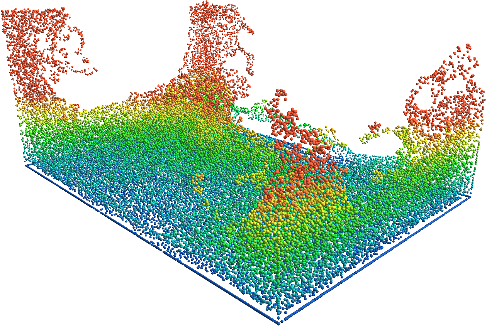
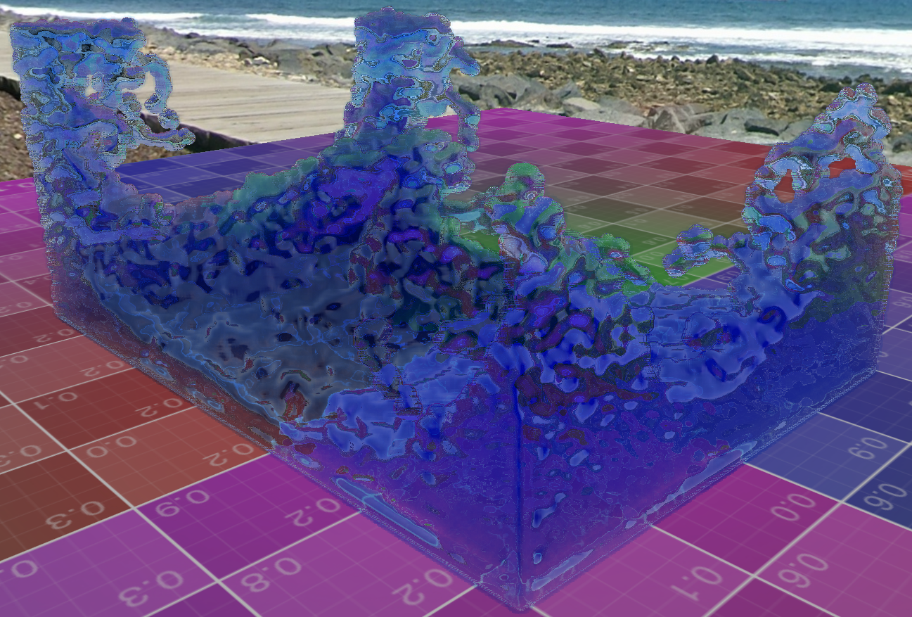

# CUDA-accelerated fluid simulation and rendering 
Joint project for GPU Computing and Real Time Graphics Programming courses. 

The particle simulation is computed entirely in CUDA and C++, while the screen-space fluid rendering is performed using OpenGL 4.4.

<center>
<p float="left">
    
    
</p>
</center>

### Required libraries
The OpenGL dependencies can be installed with [vcpkg](https://github.com/microsoft/vcpkg), which should be located in the `src/include` folder:
```bash
$ cd src/include && git clone "https://github.com/microsoft/vcpkg.git"
```
The [imgui](https://github.com/ocornut/imgui) library is required to display the application GUI, it has to be cloned in the `src/include` directory as well:
```bash
$ git clone "https://github.com/ocornut/imgui.git"
```

Finally, the required libraries can be installed with vcpkg with the following command:
```bash
$ cd vcpkg && ./bootstrap-vcpkg.sh -disableMetrics && \
    ./vcpkg install assimp glad glfw3 glm stb
```

---

This project was developed and tested on a system with a GNU/Linux x64 distribution, equipped with an Nvidia RTX 2080 GPU. In order to be used on older graphics cards, the Makefile must be updated with the correct `-arch=sm_XX` flag of the `nvcc` command. The SM generation/feature table can be looked up over [here](https://docs.nvidia.com/cuda/cuda-compiler-driver-nvcc/#gpu-feature-list). 

For installing the CUDA-dev dependencies, refer to Nvidia's guides.  

### Project building

To build the project, use the provided Makefile:
```bash
$ cd src
$ make -f Makefile
```

Then run the application:
```bash
$ ./FluidSim.out
```

### Demo
A quick video of the simulation can be seen here:
<center>

[](https://youtu.be/17tP9hG2xec)

</center>

### Acknowledgements
This work was heavily inspired by Sebastian Lague's stunning series of videos on fluid simulation and rendering ([this](https://youtu.be/rSKMYc1CQHE?si=Ohb6Hl9U1cytcypc) and [this](https://youtu.be/kOkfC5fLfgE?si=0BZ-1FIjsLD_8l_T)), so thanks a lot Sebastian :)